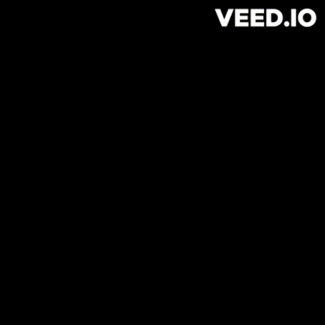

<!-- First section -->

<!--Add a gif here -->

  

  

<ul>
 <li> 💻 Apreciador da área de tecnologia e tudo que está relacionado a ela.Também curto animes,filmes e jogos.

 <li>🧐Estou me capacitando na área de frontend, mas almejo,futuramente, me tornar um desenvolvedor voltado pra área mobile e por fim fullstack. É o meu objetivo a longo prazo.

 <li>🔭 Tenho me familiarizado com as ferramentas mais atuais e relevantes do mercado. Meu foco é evoluir e assim adiquirir uma maior autonomia em nas mais diversas tecnologias existentes.

 <li>📱 Vivendo e aplicando os ecossistemas de React e Angula todos os dias.
 
 <li> 🏋💪Tenho o hábito de me exercitar regurlamente. Adoro aeróbicos,caminhadas e academia.
 <li>
 

 
 Curiosidades:
  

 <ul> 
  <li> 🤓Tenho um hobby de estudar e aprender outros idiomas. 
 
  <li>🎯Meu nivel no inglês é avançado.

  <li>🎮 Adoro desenhar.E amo estar imerso em tudo relacionado a arte.

  <li>🎸Atualmente estou aprendendo a tocar violão.
 </ul> 
 

 </li>
 </ul>
 
 

<!-- End of first section -->

  

<table align='right' height="255px">
<tr>

 <td align='center'>
   
   
  <b>
  <pre>CSS</pre>
  
  </b>
 </td>

 <td align="center">
   
  
  <b>
  <pre>Javascript</pre> 
  </b>
  
 </td>  
 <td align='center'>
     
   
   <b>
   <pre>Html</pre>
   </b>
   
 <td>
</tr>
<tr>
  <td align="center">
    
 
  <b>
  <pre>Booststrap</pre>
  </b>
 </td>

 <td align="center">
   
  <b>
  <pre>Git</pre>
  </b>
 </td>  

 <td align="center">
   
  <b><pre>Github</pre></b>
 </td>
</tr>

<tr>
 <td align="center">
    
   <b>
   <pre>Angular</pre>
   </b>
 </td>

  <td align="center">
    
   <b>
   <pre>React</pre></sun>
  </td> 

  <td align="center">
   
   <b>
   <pre>VScode</pre>
   </b>
  </td>
</tr>
</table>

            

  

<!---Imagem aqui-->
 

 
 
   

 Likedin

 Telegram

  

  

<tr>
  
  <td>

